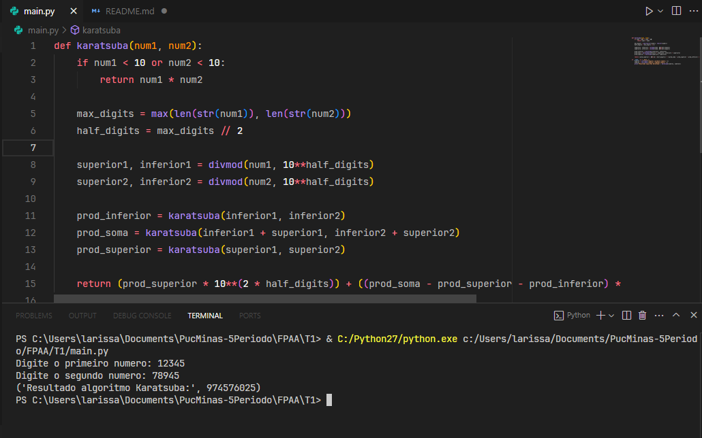
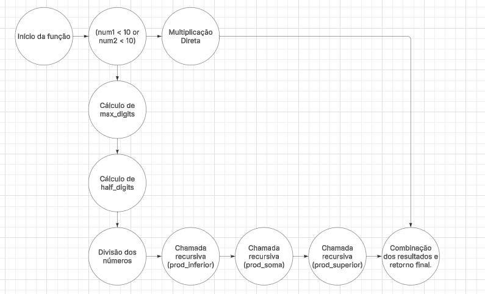

   # Algoritmo de Karatsuba
   
   ## Descrição do projeto
   O trabalho desenvolvido representa a implementação do algoritmo de Karatsuba. O algoritmo de Karatsuba reduz a quantidade de operações necessárias na multiplicação de números grandes, seguindo a ideia de dividir cada número em duas partes (superior e inferior) e combinar os resultados com menos multiplicações do que a forma tradicional.
   
   ## Como executar o projeto
   
   1. **Pré-requisitos**:
      - Ter o Python 3 instalado.
   
   2. **Passos para Execução**:
       - **Clonar o repositório**:      
        ```bash
          git clone https://github.com/larisilvapedrosa/Algoritmo_Karatsuba.git
        ```
   
        - **Navegar até o diretório do projeto**:      
        ```bash
          cd Algoritmo_Karatsuba
        ```
   
        - **Executar o programa**:      
        ```bash
          python main.py
        ```
   
        - **Interação**:      
        Insira os números solicitados e verifique o resultado exibido.
    
   ## Implementação
   1. De início é realizada a seguinte verificação: se um dos números tem apenas um dígito (ou seja, é menor que 10), a multiplicação pode ser feita diretamente:
   
   ```python
     if num1 < 10 or num2 < 10:
           return num1 * num2
   ```
   
   2. Após a verificação dos dois números é feito a conversão dos números para string para determinar a quantidade de dígitos. <br/>
      'max_digits' é o maior número de dígitos entre os dois números:
   ```python
     max_digits = max(len(str(num1)), len(str(num2)))
   ```
   
   3. half_digits half_digits é a metade do número de dígitos. <br/>
      Essa divisão ira separar o número em duas partes: superior e inferior:
   ```python
     half_digits = max_digits // 2  
   ```
   
   4. Separa cada número em duas partes usando divisão inteira e o operador divmod.<br/>
      Por exemplo, para num1 = 1234 e half_digits = 2, vamos ter:<br/>
      superior1 = 12 (dígitos mais significativos)<br/>
      inferior1 = 34 (dígitos menos significativos)
   ```python
     superior1, inferior1 = divmod(num1, 10**half_digits)
     superior2, inferior2 = divmod(num2, 10**half_digits)
     half_digits = max_digits // 2  
   ```
   
   5. Após isso, são feitas três chamadas recursivas para obter os seguintes produtos:
      - Chamada recursiva para calcular a multiplicação dos dígitos inferiores:
        ```python
         prod_inferior = karatsuba(inferior1, inferior2) 
        ```
        
      - Chamada recursiva para calcular a multiplicação da soma dos dígitos superiores e inferiores:
        ```python
         prod_soma = karatsuba(inferior1 + superior1, inferior2 + superior2)
        ```
        
      - Chamada recursiva para calcular a multiplicação dos dígitos superiores:
        ```python
         prod_superior = karatsuba(superior1, superior2)
        ```     
   
   6. Agora é feito a combinação dos resultados das chamadas recursivas para que seja formado o produto final.
   ```python
     return (prod_superior * 10**(2 * half_digits)) + ((prod_soma - prod_superior - prod_inferior) * 10**half_digits) + prod_inferior
   ```
   
   7. Agora é solicitado que seja informado os dois números inteiros. <br/>
   Apos isso é calculado o produto utilizando o algoritmo de Karatsuba e é exibido o resultado.
   ```python
     if __name__ == "__main__":
       numero1 = int(input("Digite o primeiro numero: "))
       numero2 = int(input("Digite o segundo numero: "))
       print("Resultado algoritmo Karatsuba:", karatsuba(numero1, numero2))
   ```
   
   ### Exemplo Saída execução
   
   
   ## Relatório Técnico
   ### Análise da Complexidade Ciclomática
   - **Nós**:
       1. Início da função.
       2. Avaliação da condição `if num1 < 10 or num2 < 10`.
       3. Retorno imediato caso a condição seja verdadeira (multiplicação direta).
       4. Cálculo de `max_digits = max(len(str(num1)), len(str(num2)))`.
       5. Cálculo de `half_digits = max_digits // 2 `.
       6. Divisão dos números em `superior` e `inferior`.
       7. Chamada recursiva para `prod_inferior`.
       8. Chamada recursiva para `prod_soma`.
       9. Chamada recursiva para `prod_superior`.
       10. Combinação dos resultados e retorno final.
   
   - **Arestas**: 11 arestas
     
   - **Número de Componentes Conexos (P)**:  
     Como temos um único programa, P = 1.
   
   - **Cálculo da Complexidade Ciclomática (M)**:  
     Utilizando a fórmula: `M = E - N + 2P` <br/>
     Temos: `M = 11 - 10 + 2*1 = 3`<br/>
     Isso mostra que existem 3 caminhos de execução independentes dentro da função.
   
   ### Análise da Complexidade Assintótica
   - **Complexidade Temporal**:
     O algoritmo de Karatsuba realiza três multiplicações recursivas em números com aproximadamente metade dos dígitos. Portanto, sua complexidade temporal é: <br/>
      `O(n^{\log_2 3}) \approx O(n^{1.585})`

   
     - **Melhor caso**: Quando n = 1 <br/>
         `𝑂(1)`   
     - **Caso medio e pior caso**: Para números grandes <br/>
         `O(n^{\log_2 3}) \approx O(n^{1.585})`
   
   - **Complexidade Espacial**:  
   A complexidade espacial é determinada principalmente pela profundidade da recursão, que é de ordem O(log n) no pior caso. O uso adicional de memória para armazenar as partes divididas e os resultados intermediários é proporcional ao tamanho dos números, mas geralmente é ofuscado pelo custo da recursão.

## Grafo


